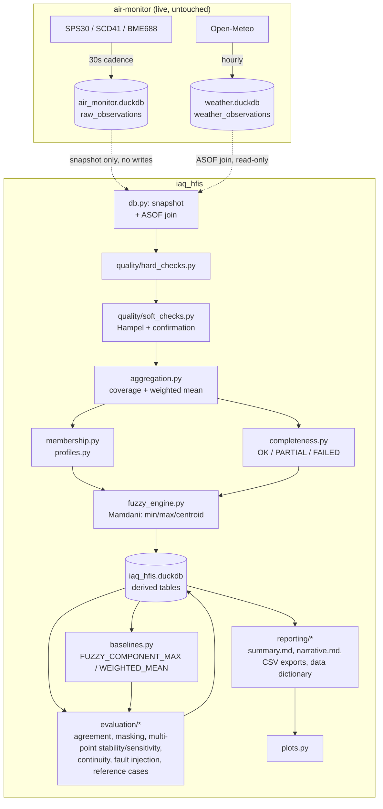

> **This README documents usage and interpretation. It does not replace
> code documentation** — every public module, class, and function has its
> own docstring; read the source for exact behavior.

**Further documentation** (`docs/`): `manuscript_method_mapping.md`
(manuscript section → code mapping), `evaluation_protocol.md` (every
analysis `evaluate` runs), `database_schema.md` (full DuckDB table
reference), `result_interpretation.md` (how to read a generated result,
what claims it does and doesn't support), `reproducibility.md` (identity
chain, how to reproduce/rebuild), `hfis_vs_crispmax_audit.md` (accidental-
equivalence audit), `fault_injection_audit.md` (benchmark correctness
audit).

---

## Table of contents

1. [Purpose and scope](#1-purpose-and-scope)
2. [Air-quality class vs. data-quality state vs. completeness status](#2-air-quality-class-vs-data-quality-state-vs-completeness-status)
3. [Architecture](#3-architecture)
4. [Directory structure](#4-directory-structure)
5. [Installation](#5-installation)
6. [Dependencies](#6-dependencies)
7. [Expected DuckDB tables and column mapping](#7-expected-duckdb-tables-and-column-mapping)
8. [Input units](#8-input-units)
9. [Configuration reference](#9-configuration-reference)
10. [Room and seasonal profiles](#10-room-and-seasonal-profiles)
11. [Hard and soft validation logic](#11-hard-and-soft-validation-logic)
12. [VALID / SUSPECT / INVALID / MISSING](#12-valid--suspect--invalid--missing)
13. [Coverage and time-weighted aggregation](#13-coverage-and-time-weighted-aggregation)
14. [Control regions](#14-control-regions)
15. [Membership-function construction](#15-membership-function-construction)
16. [Fuzzy rule base](#16-fuzzy-rule-base)
17. [Mamdani min/max/centroid procedure](#17-mamdani-minmaxcentroid-procedure)
18. [A, V, M, and I](#18-a-v-m-and-i)
19. [OK / PARTIAL / FAILED](#19-ok--partial--failed)
20. [Baseline methods](#20-baseline-methods)
21. [CLI examples](#21-cli-examples)
22. [Database outputs](#22-database-outputs)
23. [File outputs](#23-file-outputs)
24. [Every graph-ready CSV, explained](#24-every-graph-ready-csv-explained)
25. [Plotting instructions](#25-plotting-instructions)
26. [Reproducibility metadata](#26-reproducibility-metadata)
27. [Running the tests](#27-running-the-tests)
28. [Performance on Raspberry Pi 5](#28-performance-on-raspberry-pi-5)
29. [Limitations](#29-limitations)
30. [Scientific cautions](#30-scientific-cautions)
31. [Source and provenance mapping](#31-source-and-provenance-mapping)
32. [Worked example](#32-worked-example)
33. [Troubleshooting](#33-troubleshooting)
34. [How to interpret the generated result summary](#34-how-to-interpret-the-generated-result-summary)
35. [How to build article figures from exported data](#35-how-to-build-article-figures-from-exported-data)
36. [Warning: run_narrative.md is a software-generated draft](#36-warning-run_narrativemd-is-a-software-generated-draft)

---

## 1. Purpose and scope

`air-monitor` collects raw sensor readings (CO2, PM, temperature, relative
humidity, pressure) every 30 seconds into a DuckDB database. `iaq_hfis` is
a **separate, read-only consumer** of that data: it validates it, aggregates
it into rolling windows, and computes a single 0–100 index describing how
favourable the indoor air is, using a two-level Mamdani fuzzy-inference
system. It also implements two simpler baseline methods for comparison
(§20), a quantitative evaluation protocol (agreement, masking, stability,
sensitivity, ground-truth scoring), and a full reporting layer (narrative,
CSV exports, plots).

`iaq_hfis` **never** modifies `air-monitor`'s tables or disrupts its live
collection service — see [§3](#3-architecture) for how it reads the data
safely while that service is running.

Out of scope: sensor firmware/calibration, the `air-monitor` collection
pipeline itself (see its own README), and any claim of regulatory or WHO
compliance (see [§30](#30-scientific-cautions)).

## 2. Air-quality class vs. data-quality state vs. completeness status

These are three genuinely different concepts and the codebase keeps them
strictly separate:

| Concept | Values | Answers | Where |
|---|---|---|---|
| **Air-quality class** | Favourable / Acceptable / Degraded / Critical | "How good is the air, given the data we trust?" | `iaq_index_results.index_class`, `component_scores.membership_*` |
| **Data-quality state** | VALID / SUSPECT / INVALID / MISSING | "Can we trust this specific reading?" | `observation_quality.stage2_state` |
| **Completeness status** | OK / PARTIAL / FAILED | "Did we have enough trustworthy data to compute a class at all?" | `iaq_index_results.completeness_status` |

A FAILED completeness status means no air-quality class was computed — it
says nothing about whether the air was good or bad, only that the
computation couldn't be trusted enough to attempt one.

## 3. Architecture



The critical constraint driving this design: `run_pipeline.py` holds
`air_monitor.duckdb`'s write lock for its entire service lifetime, and
DuckDB allows either one read-write connection or N read-only ones — never
both at once. So `iaq_hfis` copies the file (a plain OS-level read, which
does not contend with DuckDB's connection lock — the same technique
`air-monitor/scripts/send_daily_report.py` already uses) and reads the
copy. This also means derived results **cannot** live in the same database
file — they go into a brand-new `data/iaq_hfis/iaq_hfis.duckdb`.

## 4. Directory structure

```
air_ml/
├── air-monitor/                  # live collection pipeline — UNTOUCHED by iaq_hfis
├── src/iaq_hfis/
│   ├── cli.py                    # `run` / `evaluate` / `report` / `plot` subcommands
│   ├── config.py                 # pydantic Settings / SensorSpecs / RoomProfilesConfig + loaders
│   ├── constants.py              # QualityState, ReasonCode, IaqClass, CLASS_ORDER, COMPONENT_INPUTS
│   ├── models.py                 # plain dataclasses (CoverageResult, Rule, IndexInferenceResult, ...)
│   ├── schema.py                 # schema-mapping validation, membership-width validation, channel_uncertainty
│   ├── db.py                     # AirMonitorSource (snapshot + ASOF join), DerivedResultsWriter
│   ├── timegrid.py                # expected time slots, computed_ts alignment, slot matching
│   ├── outdoor_context.py         # as-of outdoor fetch, staleness, trend signs
│   ├── quality/
│   │   ├── hard_checks.py         # presence / numeric / device-status / technical-range / PM-ordering
│   │   ├── hampel.py              # median+MAD outlier detection
│   │   ├── soft_checks.py         # orchestrates Hampel + stuck/drift detectors + confirmation
│   │   ├── confirmation.py        # cross-channel / dual-channel / persistence-only confirmation
│   │   └── reasons.py             # stuck-value and gradual-drift detectors
│   ├── aggregation.py             # coverage ρ, time-weighted mean
│   ├── profiles.py                # room/season profile selection
│   ├── membership.py              # trapezoid function, class builders, evaluate_memberships
│   ├── rules.py                   # worst-of rule generation, RuleBase
│   ├── fuzzy_engine.py            # MamdaniEngine (min/max/centroid), dominant_components, classify_output
│   ├── completeness.py            # OK/PARTIAL/FAILED
│   ├── pipeline.py                # RuntimeContext, compute_index_at, infer_from_values, run_pipeline
│   ├── baselines.py                # FUZZY_COMPONENT_MAX, WEIGHTED_MEAN
│   ├── evaluate.py                 # orchestrates the Phase 2A evaluation suite
│   ├── evaluation/
│   │   ├── _metrics.py             # percent_agreement, cohens_kappa, macro_f1
│   │   ├── reference_cases.py      # synthetic boundary-adjacent vectors + consistency scoring (NOT ground truth)
│   │   ├── agreement.py            # inter-method agreement (unlabeled real data)
│   │   ├── multi_point_stability.py    # deterministic boundary-adjacent + random-comparison perturbation sampling
│   │   ├── multi_point_sensitivity.py  # deterministic stratified window/coverage-threshold sweeps
│   │   ├── continuity.py           # HFIS vs FUZZY_COMPONENT_MAX vs WEIGHTED_MEAN boundary continuity experiment
│   │   ├── fault_injection.py      # labeled synthetic fault-injection benchmark + Hampel calibration
│   │   ├── masking.py              # masking-rate detection
│   │   └── faults.py               # status proportions, reason-code frequency (unlabeled real data)
│   ├── reproducibility.py          # environment/version metadata
│   ├── report.py                   # orchestrates Phase 2B reporting
│   ├── reporting/
│   │   ├── exports.py              # graph-ready CSVs (single column-metadata registry)
│   │   ├── data_dictionary.py      # output_data_dictionary.csv, built from exports.COLUMNS
│   │   ├── plot_manifest.py        # plot_manifest.json, validated against exports.COLUMNS
│   │   ├── summary.py              # run_summary.md
│   │   └── narrative.py            # run_narrative.md
│   ├── plots.py                    # renders PNGs from plot_manifest.json + exported CSVs
│   └── sql/create_tables.sql       # derived-DB schema (additive only)
├── config/
│   ├── iaq_hfis.yaml               # main settings
│   ├── sensor_specs.yaml           # technical ranges + declared uncertainty
│   ├── room_profiles.yaml          # temperature control regions by room/season
│   └── run_summary.schema.json     # JSON Schema for run_summary_{run_id}.json
├── data/iaq_hfis/                  # generated at runtime (gitignored)
│   ├── iaq_hfis.duckdb              # derived results
│   ├── snapshots/                   # transient air_monitor.duckdb copies (deleted after use)
│   ├── logs/
│   ├── run_summaries/               # run_summary_{run_id}.json
│   └── reports/{run_id}/            # exports/, plots/, run_summary.md, run_narrative.md, ...
├── scripts/
│   ├── run_iaq_hfis.sh              # sample end-to-end invocation (run -> evaluate -> report -> plot)
│   └── plot_iaq_hfis_results.py     # thin wrapper around `iaq_hfis.cli plot`
├── tests/
│   ├── conftest.py
│   ├── fixtures/build_synthetic_db.py
│   ├── unit/                        # ~30 files, one per module
│   └── integration/                 # snapshot+join, persistence, end-to-end pipeline/evaluate/report
└── pyproject.toml
```

## 5. Installation

### Raspberry Pi 5 (the deployment target; this is also the platform this
implementation was developed and tested on)

```bash
cd /home/<user>/python_scripts/air_ml   # air_ml/ repo root, sibling to air-monitor/
python3 -m venv .venv                    # if not already created for air-monitor
source .venv/bin/activate
pip install -e ".[dev]"                  # installs iaq_hfis + pydantic/jsonschema/matplotlib/pytest
```

No cross-compilation or extra system packages are required — `pydantic`,
`duckdb`, and `matplotlib` all ship prebuilt aarch64 wheels (verified via
piwheels.org on this exact device: Raspberry Pi OS, kernel
`6.12.62+rpt-rpi-2712`, `aarch64`).

### Generic Linux (x86_64 or aarch64)

Identical — there is nothing Pi-specific in `iaq_hfis` itself (unlike
`air-monitor`, which talks to I2C hardware). Only requirement: Python
≥3.11 and access to `air-monitor`'s DuckDB files (either on the same
machine, or copied over — the snapshot mechanism works against any local
file path).

```bash
python3 -m venv .venv
source .venv/bin/activate
pip install -e ".[dev]"
```

### Verify the install

```bash
python -m pytest tests/ -q
python -m iaq_hfis.cli run --from <ISO8601> --to <ISO8601>
```

## 6. Dependencies

Declared in `pyproject.toml`:

| Package | Why |
|---|---|
| `duckdb>=1.1.0` | Reading `air-monitor`'s data and writing derived results (already an `air-monitor` dependency) |
| `pandas>=2.0.0` | DataFrame plumbing for validation/aggregation/exports |
| `numpy>=1.26.0` | Hampel filter, perturbation sampling |
| `PyYAML>=6.0.1` | Config file parsing (already an `air-monitor` dependency) |
| `pydantic>=2.0.0` | Strict config validation with clear failure messages — **new**, not used elsewhere in the repo; justified by the task's explicit requirement for fail-clearly config validation |
| `jsonschema>=4.0.0` | Validates `run_summary_{run_id}.json` against `config/run_summary.schema.json` — **new** |
| `matplotlib>=3.9.0` | Plot rendering (already an `air-monitor` dependency, used the same headless `Agg`-backend way as `send_daily_report.py`) |
| `pytest>=8.0.0` (dev) | Test runner — **new**, `air-monitor` has no test suite |

`pydantic`, `jsonschema`, and `pytest` are new to this repository, scoped
to `iaq_hfis` via `pyproject.toml`; `air-monitor/requirements.txt` is
untouched.

## 7. Expected DuckDB tables and column mapping

`iaq_hfis` reads two tables it never writes to:

- `air_monitor.duckdb::raw_observations` — see `air-monitor/storage/schema.sql` for the authoritative schema.
- `weather.duckdb::weather_observations` — see `air-monitor/storage/weather_schema.sql`.

At startup (`build_runtime_context` in `pipeline.py`), `schema.validate_schema_mapping`
checks every column named in `config/iaq_hfis.yaml`'s `schema_mapping` actually
exists in the live `raw_observations` schema, and fails loudly (listing the
missing columns) if not.

Column mapping is fully configurable — nothing is hardcoded to a specific
column name outside `schema_mapping`:

```yaml
schema_mapping:
  channels:
    - canonical_name: pm2_5
      source_column: mass_pm2_5
      device_status_column: sps30_status
    - canonical_name: temperature
      source_column: bme_temp_c        # primary
      secondary_column: scd_temp_c     # used only for dual-channel confirmation
      device_status_column: bme688_status
    # ... pm10, co2, humidity similarly
```

If your `raw_observations` schema uses different column names, only
`schema_mapping` needs to change — no code changes required.

## 8. Input units

| Channel | Raw column | Unit |
|---|---|---|
| PM2.5 | `mass_pm2_5` | µg/m³ |
| PM10 | `mass_pm10` | µg/m³ |
| PM1.0, PM4.0 (auxiliary, PM cross-check only) | `mass_pm1_0`, `mass_pm4_0` | µg/m³ |
| Particle number concentrations (auxiliary) | `number_pm0_5` … `number_pm10` | #/cm³ |
| Typical particle size (auxiliary) | `typical_size_um` | µm |
| CO2 | `co2_ppm` | ppm |
| Temperature | `bme_temp_c` / `scd_temp_c` | °C |
| Relative humidity | `bme_humidity_pct` / `scd_humidity_pct` | % |
| Pressure (not used directly) | `pressure_hpa` | hPa |
| Outdoor PM2.5/PM10 | `weather_observations.pm2_5`/`pm10` | µg/m³ |
| Outdoor temperature | `weather_observations.temperature_2m` | °C |
| Outdoor CO (never CO2!) | `weather_observations.carbon_monoxide` | µg/m³ |

The index itself (`I`, and every component `A`/`V`/`M`) is unitless, on a
fixed 0–100 scale (§18).

## 9. Configuration reference

Three YAML files, loaded independently (`iaq_hfis.config.load_settings` /
`load_sensor_specs` / `load_room_profiles`), each `extra="forbid"` so a
typo'd key fails loudly rather than being silently ignored.

### `config/iaq_hfis.yaml`

| Section | Key | Meaning | Provisional? |
|---|---|---|---|
| `paths` | `air_monitor_db_path`, `weather_db_path` | Read-only source DBs | — |
| | `derived_db_path` | Where `iaq_hfis` writes its own results | — |
| | `snapshot_dir`, `log_path`, `run_summary_dir` | Working directories | — |
| `cadence` | `sample_cadence_seconds` (30) | Sensor collection cadence | manuscript |
| | `aggregation_window_minutes` (15) | Primary rolling window | manuscript |
| | `allowed_window_minutes` ([5,15,30,60]) | Valid window sizes (validated against) | manuscript |
| | `recompute_interval_minutes` (5) | How often the index is recomputed | manuscript |
| | `slot_match_tolerance_seconds` (15.0) | Max jitter before a slot counts MISSING | **yes** — half the cadence, chosen because `computed_ts` has an arbitrary phase offset from the sensor's own cadence |
| `coverage` | `min_ratio` (0.80) | Minimum ρ for a channel to be usable | manuscript |
| `hampel` | `window_size` (11), `mad_multiplier` (1.0) | Outlier-candidate detection | **yes** — but grounded in the manuscript's own cited paper's worked example (Pearson et al. 2016, K=5→11-point window, t=1), not an unsourced guess; see §31 |
| `confirmation` | `pm_cross_channel_tolerance_pct` (20.0) | PM ordering/cross-check tolerance | **yes** |
| | *(dual-channel T/RH tolerance)* | NOT a config key — derived at runtime as `declared_uncertainty(primary) + declared_uncertainty(secondary)` from `sensor_specs.yaml` (`schema.dual_channel_tolerance`), so it can't drift out of sync | sensor_specification |
| | `persistence_min_consecutive_samples` (2) | Min run length for confirmation | **yes** |
| | `stuck_value_min_repeats` (5) | Min identical-value run length | **yes** |
| | `gradual_drift_min_consecutive_steps` (5) | Min same-direction run length | **yes** |
| | `gradual_drift_magnitude_multiplier` (3.0) | Run must also move ≥ this × declared_uncertainty | **yes** — added to fix a real false-positive rate against live data, see §29 |
| | `outdoor_context_max_age_minutes` (120.0) | Staleness threshold for outdoor data | author_defined — 2x the real hourly `fetch_weather.py` cron cadence |
| `schema_mapping` | `required_raw_columns`, `channels` | See §7 | — |
| `device_status_state_map` | `ok`→VALID, `partial`→VALID, `failed`→INVALID, `disabled`→MISSING, `data_not_ready`→MISSING | Maps `air-monitor` status flags to quality states | — |
| `membership` | `output_transition_width` (2.0) | Overlap width for the output scale | **yes** |
| | `overlap_width_policy` (`reject`\|`auto_expand`) | What to do if a width < declared uncertainty | — (policy choice) |
| | `dominant_component_tie_tolerance` (1.0) | Crisp-score margin within which multiple components are jointly reported as dominant adverse | author_defined |
| `deployment` | `room_type` (`kitchen`), `room_type_evidence`, `season_source` (`timestamp`) | Explicit, author-attested deployment room classification -- never inferred from sensor values; rules out treating this deployment as a kitchen-dining space just to unblock a warm-period profile (§10) | — (author-attested fact) |
| `profile_selection` | `room` (`kitchen`) | Which room profile to use | — (matches real deployment) |
| | `season_month_ranges` | Calendar cutover months | **yes** |
| `control_regions` | `pm2_5`, `pm10`, `co2`, `relative_humidity`, `output` | See §14 | breakpoints = manuscript/standard; transition_widths = **yes** (mostly sensor_specification-matched) |
| `evaluation` | `stability_seed` (42), `stability_n_trials` (30) | Perturbation analysis | **yes** |
| | `stability_max_boundary_samples` (20), `stability_max_random_samples` (10) | Multi-point stability sample-size bounds | author_defined |
| | `sensitivity_window_minutes`, `sensitivity_coverage_thresholds` | Sweep values | manuscript |
| | `sensitivity_max_samples_per_stratum` (5) | Multi-point sensitivity sample-size bound | author_defined |
| | `masking_severity_threshold` (`Critical`) | Which severity counts as "hidden" | **yes** |
| | `continuity_grid_points` (21) | Boundary continuity experiment grid density | author_defined |
| | `multi_component_grid_points_per_axis` (11; override to 41 via `evaluate --multi-component-grid-points` for the spec's own worked example) | Independent A/V/M grid experiment resolution per axis | author_defined |
| `engine_version` | `"0.1.0"` | Recorded in every derived row and run summary | — |

Full per-parameter machine-readable provenance (path, effective value,
unit, status, source, engaged-this-run) is generated every `report` call
into `parameter_provenance.csv` — see `src/iaq_hfis/provenance.py` and
`docs/manuscript_method_mapping.md`. The table above is a human-readable
summary; the CSV is the authoritative, testable version. For a
per-PROVISIONAL-parameter assessment (whether it was calibrated, against
what dataset, whether conclusions depend strongly on it, recommended
future validation), see the generated `provisional_parameter_assessment.md`.

### `config/sensor_specs.yaml`

Per-channel `min`, `max` (technical/passport range), `unit`, `source`
(citation), `declared_uncertainty` (used for membership-width validation,
stability perturbation magnitude, dual-channel confirmation tolerance, and
gradual-drift magnitude gating). **Verified directly against the official
manufacturer datasheets** (2026-07-24; Sensirion SPS30 v2.0 D1 June 2023,
Sensirion SCD4x v1.7 April 2025, Bosch BME688 Rev.1.3 Feb 2024) — see §31
for exact table/page citations. PM channels are split into `pm_mass_fine`
(PM1.0/PM2.5, ±5 µg/m³) and `pm_mass_coarse` (PM4.0/PM10, ±25 µg/m³) since
the SPS30 datasheet specifies materially different precision for them — a
real correction made 2026-07-24 (PM10 was previously validated against the
PM2.5 figure, 5× too tight). Every real-world accuracy spec is a
value-dependent formula (e.g. ±[5 µg/m³ + 5% of reading]); each
`declared_uncertainty` here is a single representative constant chosen for
this deployment's typical operating range, documented per-entry.

### `config/room_profiles.yaml`

List of `{room, season, provisional, ranges}` entries. See §10.

## 10. Room and seasonal profiles

Three temperature profiles are currently defined:

| Room | Season | Source | Favourable band |
|---|---|---|---|
| `kitchen` | `cold_period` | DBN Table Д.4, "інші об'єми (кухня, гардеробна, комора тощо)", heating-period column — verified directly against **ДБН В.2.5-67:2013, Додаток Д, Таблиця Д.4** (p.100) | 18.0–21.0 °C |
| `general_residential` | `warm_period` | DBN Table Д.4, "житлові об'єми (..., **кухня-їдальня**...)", cooling-period column — same DBN table | 23.5–25.5 °C |
| `kitchen` | `warm_period` | **Substitute standard** (DBN itself has no value — see below): ДСТУ Б EN 15251:2011, Таблиця А.2, "Житлові приміщення: спальні, вітальні, **кухні** тощо" (kitchen named explicitly), sedentary ~1.2 met, Category I/II/III | 21.0–25.5 °C |

**DBN Table Д.4's standalone-kitchen row has a literal dash in the
cooling-period column**: the standard genuinely gives no summer value for
this exact room type. Investigated further into ДБН В.2.2-15:2019 (which
likely only re-references the same EN 15251/16798-1 framework DBN
B.2.5-67's own table is already built from) without finding an independent
kitchen-specific figure there either.

**Resolved via an explicit author decision + substitute-standard
citation**: rather than leave the microclimate (M) component permanently
undefined for this deployment's real (all warm-period) data, `kitchen`/
`warm_period` is sourced to **ДСТУ Б EN 15251:2011**
("Розрахункові параметри мікроклімату приміщень...", the Ukrainian IDT
adoption of EN 15251:2007 — the same EN framework DBN B.2.5-67's own table
is built from), which has its own Таблиця А.2 ("Examples of recommended
design values of the indoor temperature for design of buildings and HVAC
systems"), naming **кухні (kitchens)** explicitly in a residential row
alongside bedrooms/living rooms, with real Category I/II/III
heating-min/cooling-max values:

| Category | Heating min | Cooling max |
|---|---|---|
| I | 21.0 °C | 25.5 °C |
| II | 20.0 °C | 26.0 °C |
| III | 18.0 °C | 27.0 °C |

Verified directly against the standard PDF (not a secondhand summary):
freely downloadable, Ukrainian-hosted, p.35. Categories I/II/III are
nested (I ⊂ II ⊂ III) and mapped into `room_profiles.yaml`'s
favourable/acceptable/degraded/critical schema the same way DBN's
Підвищені оптимальні/Оптимальні/Допустимі tiers are mapped elsewhere in
this file. Note the same standard's Table A.3 (hourly energy-calculation
ranges — a different purpose from Table A.2's design/comfort bands) groups
kitchen with storage/halls instead and has **no** cooling value for that
grouping either — Table A.2 is the structurally correct analogue to DBN's
Table Д.4 (design/comfort bands, not hourly simulation ranges), and is the
one actually used.

**The real deployed sensor is in a standalone/enclosed kitchen** (confirmed
by the author, see `config/iaq_hfis.yaml`'s `deployment:` block) — **not**
a kitchen-dining/general-residential space, and this profile does not
reclassify it as one: it is still keyed to `room: kitchen`, just sourced to
a different (DSTU, not DBN) standard for the warm period specifically. A
room/season combination with **neither** a DBN nor a DSTU citation (e.g.
`general_residential`/`cold_period`) still fails loudly with a structured
`TEMPERATURE_PROFILE_NOT_DEFINED` error — never a silent fallback, never
DBN-row substitution, never fabrication.

Adding a new room/season combination is config-only (`room_profiles.yaml`);
`profiles.select_room_season` fails loudly, listing available profiles and
the DBN/DSTU source, if the requested combination doesn't exist — it never
silently falls back to another room, another season, interpolation, or
outdoor temperature.

## 11. Hard and soft validation logic

Two sequential stages, per direct-input channel, per expected time slot
(`quality/hard_checks.py` then `quality/soft_checks.py`):

**Stage 1 (hard):**
1. Record presence (no matched raw row within tolerance → MISSING)
2. Device status flag (`sensor_status`/`scd41_status`/`bme688_status`/`sps30_status`, mapped via `device_status_state_map`)
3. Numeric format (non-finite/non-numeric → INVALID)
4. Technical range (`sensor_specs.yaml` min/max → INVALID if violated)
5. PM ordering (PM1 ≤ PM2.5 ≤ PM4 ≤ PM10, with tolerance → INVALID if violated)

**Stage 2 (soft), only for stage-1-VALID points:**
1. Hampel filter (median + MAD) flags local outlier candidates as SUSPECT.
   **Causal window**: for point x_i, the window is x_i and the
   `window_size - 1` samples immediately preceding it — never a later one
   (see `iaq_hfis.quality.hampel`'s module docstring). Because the primary
   15-minute window alone doesn't contain enough preceding samples for its
   own earliest points to ever reach a full causal window, `iaq_hfis run`
   fetches `window_size - 1` extra raw samples of **historical context**
   before `window_start` for every computed_ts (never after `computed_ts`)
   — used only to classify in-window points' quality state, then discarded
   before aggregation/coverage/completeness, which are always scoped to the
   requested window only. This is what lets the 5-minute sensitivity window
   (only 10 slots) still use an 11-point causal filter.
2. Stuck-value detector (run of ≥N identical values)
3. Gradual-drift detector (run of ≥N same-direction steps **and** cumulative magnitude ≥ a multiple of declared uncertainty — see §29 for why the magnitude gate matters). Also causal: a point is flagged only once IT is the latest point of a qualifying run, never retroactively once a later point confirms the run.
4. Confirmation: PM channels via auxiliary-channel/outdoor-trend corroboration + persistence; T/RH via dual-channel agreement + persistence; CO2 via persistence only (no cross-channel signal exists for it)
5. Only VALID or confirmed-SUSPECT points are `usable` (count toward coverage and the time-weighted mean)

## 12. VALID / SUSPECT / INVALID / MISSING

| State | Meaning | Usable? |
|---|---|---|
| **VALID** | Passed all hard checks and (if a Hampel/stuck/drift candidate) was never flagged | Yes |
| **SUSPECT** | Flagged as a candidate anomaly, tentatively — not removed | Only if confirmed |
| **INVALID** | Technical error, device fault flag, or out-of-range | No |
| **MISSING** | No record for this expected slot | No |

These describe **data quality only** — they say nothing about whether the
air was clean or polluted (§2).

## 13. Coverage and time-weighted aggregation

```
ρᵢ(t) = Nᵢ,usable(t) / Nᵢ,expected(t)
```

`Nᵢ,expected` = slots in the rolling window at the configured cadence (30
per 15-min window at 30 s cadence). Coverage is `ok` iff `ρ ≥ min_ratio`
(default 0.80 — 24/30 passes, 23/30 fails exactly, matching the
manuscript's own worked numbers).

```
C̄ᵢ,w(t) = Σₖ Cᵢ(tₖ)·Δtₖ·uᵢ(tₖ) / Σₖ Δtₖ·uᵢ(tₖ)
```

`uᵢ(tₖ) = 1` for usable points, else `0`. `Δtₖ` (PROVISIONAL — the
manuscript gives the formula's shape, not the practical weight
assignment): midpoint-rule interval to each point's usable neighbors,
clipped to the window bounds at the edges (`aggregation.py:time_weighted_mean`).

## 14. Control regions

Table 2 of the manuscript, exactly as configured in `control_regions`:

| Channel | Favourable | Acceptable | Degraded | Critical | Source |
|---|---|---|---|---|---|
| PM2.5 (µg/m³) | ≤15 | 15–25 | 25–50 | >50 | WHO 2021 |
| PM10 (µg/m³) | ≤45 | 45–75 | 75–100 | >100 | WHO 2021 |
| CO2 (ppm) | ≤800 | 800–1000 | 1000–1500 | >1500 | Operational ventilation scale (not a toxicity limit — §30) |
| RH (%) | 30–50 | 25–<30 or >50–60 | 20–<25 or >60–70 | <20 or >70 | ДБН В.2.5-67:2013 Table Д.5 |
| T, kitchen/cold | 18–21 | 16.5–<18 or >21–22.5 | 15.5–<16.5 or >22.5–23.5 | <15.5 or >23.5 | ДБН В.2.5-67:2013 Table Д.4 |
| T, general_residential/warm | 23.5–25.5 | 23–<23.5 or >25.5–26 | 22–<23 or >26–27 | <22 or >27 | ДБН В.2.5-67:2013 Table Д.4 |
| T, kitchen/warm | 21–25.5 | 20–<21 or >25.5–26 | 18–<20 or >26–27 | <18 or >27 | ДСТУ Б EN 15251:2011 Table A.2 (substitute standard — §10) |
| Output index I | [0,25) | [25,50) | [50,75) | [75,100] | The proposed method's own scale |

## 15. Membership-function construction

Every class is a trapezoid `μ(x;a,b,c,d) = max(0, min((x-a)/(b-a), 1, (d-x)/(d-c)))`
(`membership.py:trapezoid`), with `±math.inf` sentinels for pure shoulders
(extreme classes on monotonic channels). Monotonic channels (PM2.5, PM10,
CO2, output) get right-shoulder-only Favourable/Critical classes (higher
never improves the class). Two-sided channels (T, RH) get Critical/Degraded/
Acceptable as the union of a low-side and high-side band, and a single
central Favourable band. Two adjacent classes sharing a numeric boundary
cross at exactly membership 0.5 there (verified by test).

Transition (overlap) width must be ≥ the channel's `declared_uncertainty`
(`schema.validate_membership_config`) — `overlap_width_policy: reject`
fails loudly if not, `auto_expand` clamps up and records the adjustment.

## 16. Fuzzy rule base

Deterministic worst-of (max-severity) rule generation
(`rules.py:generate_component_rules`): Cartesian product over the 4
classes for each input, consequent = the highest-severity antecedent
class. `A ← (pm2_5, pm10)` = 16 rules, `M ← (temperature, humidity)` = 16
rules, `I ← (A, V, M)` = 64 rules — **96 total**. `V` is a single-input
pass-through (no combination rules needed). This single choice provably
gives three properties simultaneously: worsening any input never improves
the consequent; any Critical input forces a Critical consequent; the
consequent is Favourable only when every input is Favourable.

## 17. Mamdani min/max/centroid procedure

`fuzzy_engine.py:MamdaniEngine`:
1. **Firing strength** = min of each rule's antecedent membership degrees
2. **Aggregation** = max, per consequent class, across all fired rules
3. **Defuzzification** = centroid over the output universe `[0,100]`,
   discretized at 401 points

Output classification (`classify_output`) is closed on the *worse* side at
the boundaries: `[0,25)` Favourable, `[25,50)` Acceptable, `[50,75)`
Degraded, `[75,100]` Critical — per the manuscript's explicit statement
about the output scale specifically (direct-input Table 2 boundaries keep
their own literal ≤/> convention and only parameterize the continuous
membership functions).

## 18. A, V, M, and I

| Symbol | Name | Inputs | Meaning |
|---|---|---|---|
| **A** | Aerosol | PM2.5, PM10 | Particulate-matter component |
| **V** | Ventilation | CO2 | Ventilation-adequacy component (not a toxicity index — §30) |
| **M** | Microclimate | Temperature, RH | Thermal-comfort component |
| **I** | Integral index | A, V, M | Final 0–100 index, worst-of aggregated |

A, V, M are intermediate fuzzy results of one integral method, not
independent official indices. Alongside `I` and its class, the pipeline
records the manuscript's dominant adverse component via a deterministic
5-step priority hierarchy (`fuzzy_engine.determine_dominance`: max-firing
2nd-level rule → most severe consequent → causing antecedent(s) → highest
severity → tie-break by normalized score) — `dominant_component` (single,
deterministic primary), `co_dominant_components` (the full tied set, ties
preserved and documented), `worst_component_class`,
`largest_component_score`, and `dominance_reason`. See
`docs/database_schema.md`.

## 19. OK / PARTIAL / FAILED

| Status | Condition | Index/class |
|---|---|---|
| **OK** | All 3 components available (every direct input meets coverage) | Computed |
| **PARTIAL** | Exactly 1 component unavailable | Computed from the remaining 2 (rules regenerated over just those components — see `fuzzy_engine.py:infer_index`) |
| **FAILED** | ≤1 component available, or ≥2 under-covered | `null` — never a placeholder number |

Aerosol `A` requires **both** PM2.5 and PM10 to individually meet
coverage; microclimate `M` requires **both** T and RH.

## 20. Baseline methods

| Method | Formula | Notes |
|---|---|---|
| **FUZZY_COMPONENT_MAX** | `max(component crisp scores)` | Reproduces a prior paper's logic; still operates on already-fuzzified, smoothly-varying component scores -- a diagnostic baseline, not the hard one the manuscript's introduction criticises |
| **CRISP_CLASS_MAX** | Hard-classify each available direct input via the class control-region breakpoints (no fuzzy overlap), take the most adverse per-component class, map deterministically to a fixed representative value | The genuinely discontinuous baseline -- exhibits a true step at every control-region boundary (`baselines.crisp_class_max`) |
| **WEIGHTED_MEAN** | `mean(component crisp scores)` | Neutral, no expert weighting; can and does mask a critical component by dilution — this is the phenomenon `evaluation/masking.py` measures |
| **PROPOSED_HFIS** | Two-level Mamdani (§17) | The method this repository implements |

All four degrade over available components identically (never impute a
value for a missing one).

## 21. CLI examples

All commands run from the `air_ml/` repo root, module form
`python -m iaq_hfis.cli <command>` (or use `scripts/run_iaq_hfis.sh` for
the whole pipeline at once). Every derived-DB row is isolated by
`pipeline_run_id` (and, for evaluation tables, `evaluation_run_id`) — see
`docs/reproducibility.md`.

```bash
# 1. Compute the index over a time range and persist results (creates a fresh pipeline_run_id).
#    mode=publication (default, strict): a missing DBN temperature profile aborts the whole run.
#    mode=exploratory: the microclimate component is omitted (never fabricated) where no profile
#    exists; the run is tagged exploratory and can never be finalized into research_results/final.
python -m iaq_hfis.cli run --from 2026-07-23T00:00:00+00:00 --to 2026-07-23T06:00:00+00:00 [--mode publication|exploratory]

# -> prints: Run <pipeline_run_id> (mode=publication): success
#    processed N timestamps over window=15min
#    completeness: {'OK': .., 'PARTIAL': .., 'FAILED': ..}

# 2. Run the full evaluation suite (agreement, masking, reference cases, multi-point
#    stability/sensitivity, boundary continuity, multi-component grid, fault-injection
#    benchmark) -- always creates a NEW evaluation_run_id, never mixes rows with a prior
#    evaluation. --multi-component-grid-points overrides the per-axis grid resolution
#    (default kept modest; use 41 for the manuscript-validation task spec's own worked example).
python -m iaq_hfis.cli evaluate --from 2026-07-23T00:00:00+00:00 --to 2026-07-23T06:00:00+00:00 --pipeline-run-id <id> [--multi-component-grid-points 41]

# 3. Generate run_summary.md, run_narrative.md, article_results_summary.md, CSVs,
#    data dictionary, plot manifest, parameter_provenance.csv,
#    provisional_parameter_assessment.md, parameter_selection.json,
#    manuscript_readiness.json/.md, and publication_claims_matrix.csv/.md
#    (readiness persisted back into run_summary.json)
python -m iaq_hfis.cli report --pipeline-run-id <id>

# 4. Render PNGs from the plot manifest
python -m iaq_hfis.cli plot --pipeline-run-id <id>

# 5. Cross-check every artifact against the derived DB and each other; exits non-zero on
#    any mismatch; writes artifact_validation.json/.md
python -m iaq_hfis.cli validate-artifacts --pipeline-run-id <id>

# 6. Rebuild the derived database (never touches raw air-monitor/weather source DBs) --
#    required if it predates the run-isolated schema (LegacySchemaError)
python -m iaq_hfis.cli rebuild-db --confirm

# 7. Run the full test suite (required before finalize; refuses if ok=false)
python -m iaq_hfis.cli test-report

# 8. Build the tracked publication snapshot -- requires artifact_readiness,
#    the same git commit that computed the run, and a clean working tree.
#    Refuses if pipeline_run_id was computed with --mode exploratory.
python -m iaq_hfis.cli finalize --pipeline-run-id <id> --test-report-json test_report.json

# 8b. For an exploratory-mode run: writes research_results/exploratory/ instead
#     (never research_results/final/ -- the microclimate component was omitted)
python -m iaq_hfis.cli finalize --pipeline-run-id <id> --exploratory

# All of 1-4 at once, over the last 24 hours:
scripts/run_iaq_hfis.sh 1440

# Custom window size:
python -m iaq_hfis.cli run --from ... --to ... --window-minutes 30

# Custom config location:
python -m iaq_hfis.cli run --config /path/to/iaq_hfis.yaml --from ... --to ...
```

Configuration errors (missing settings, unknown room/season combination
encountered mid-run) and legacy-schema errors print a clear message and
exit with code 2, never a raw traceback.

## 22. Database outputs

All in a **new**, dedicated, run-isolated file (`data/iaq_hfis/iaq_hfis.duckdb`)
— never `air_monitor.duckdb`. Schema: `src/iaq_hfis/sql/create_tables.sql`
(idempotent `CREATE TABLE IF NOT EXISTS`; schema_version tracked, legacy
pre-isolation databases are detected and rejected -- see §33 and
`docs/reproducibility.md`). **Full table-by-table reference:
`docs/database_schema.md`** — the summary below is abbreviated.

| Table | One row per | Key columns |
|---|---|---|
| `observation_quality` | (pipeline_run_id, expected slot, channel) | stage1_state, stage2_state, usable, confirmed, reason_codes |
| `window_aggregates` | (pipeline_run_id, computed_ts, window_minutes, channel) | n_expected, n_usable, coverage_ratio, weighted_mean |
| `outdoor_context` | (pipeline_run_id, computed_ts) | forecast_time, age_minutes, is_stale, pm2_5, pm10, temperature_2m |
| `component_scores` | (pipeline_run_id, computed_ts, window_minutes, component) | available, membership_*, crisp_score, room, season |
| `iaq_index_results` | (pipeline_run_id, computed_ts, window_minutes) | completeness_status, index_value, index_class, dominant_component, co_dominant_components, worst_component_class, dominance_reason, rule_level_contributors |
| `pipeline_runs` | pipeline_run_id | status, computed_ts_min/max, config_hash, source_git_commit |
| `evaluation_runs` | evaluation_run_id | pipeline_run_id, status, evaluated_range, config_hash, stability_seed |
| `baseline_results` | (pipeline_run_id, evaluation_run_id, computed_ts, window_minutes, method) | index_value, index_class, n_components |
| `evaluation_agreement` | (evaluation_run_id, method_a, method_b) | percent_agreement, cohens_kappa |
| `evaluation_stability_samples` / `evaluation_stability_trials` | sample / (sample, method, trial) | selection_reason, baseline_class_*, trial_class, changed_from_baseline |
| `evaluation_sensitivity` | (evaluation_run_id, sample_id, varied_parameter, value) | stratum, reference_*, completeness_status, index_value |
| `evaluation_masking` | (evaluation_run_id, method, severity_threshold) | n_critical_events, n_masked, masking_rate |
| `evaluation_reference_cases` | (evaluation_run_id, method) | n, macro_f1, cohens_kappa (consistency, not accuracy) |
| `evaluation_continuity_grid` / `evaluation_continuity_summary` | grid point / (boundary, context, method) | context (favourable/acceptable/degraded); index_value; max/mean_adjacent_jump, local_lipschitz_ratio, area_between_curves_vs_crisp_max |
| `fault_injection_events` / `fault_detection_predictions` | event / sample | dataset_split (calibration/validation); fault_type; predicted_reason_codes |
| `fault_detection_metrics` / `fault_detection_event_metrics` | (dataset_split, reason_code) | row-level tp/fp/fn/tn/specificity vs. event-level one-to-one-matched tp/fp/fn |
| `fault_detection_confusion_matrix` | (dataset_split, true_label, predicted_label) | count |
| `hampel_calibration` | (evaluation_run_id, dataset_split, window_size, mad_multiplier) | fault_recall, genuine_event_preservation_rate, objective_score, selected |
| `parameter_provenance` | declared, not currently written (see `docs/database_schema.md`) | `parameter_provenance.csv` is generated directly from Python objects instead |

## 23. File outputs

Per run, under `data/iaq_hfis/`:

```
run_summaries/run_summary_{pipeline_run_id}.json   # written by `run`, extended by `evaluate`/`report`
reports/{pipeline_run_id}/
  run_summary.md                            # written by `report`
  run_narrative.md
  article_results_summary.md / article_metrics.json
  provisional_parameter_assessment.md       # per-provisional-parameter assessment, generated
  artifact_validation.json / .md            # written by `validate-artifacts`
  output_data_dictionary.csv
  parameter_provenance.csv
  plot_manifest.json
  exports/*.csv                             # see §24
  plots/*.png                               # written by `plot`
```

Plus the tracked, static publication snapshot `research_results/final/`
(committed to git, replaced atomically by the final-run procedure, plus
`manifest.json`'s full checksummed integrity record) — see
`research_results/final/README.md` and `docs/reproducibility.md`.

## 24. Every graph-ready CSV, explained

All written by `reporting/exports.py`, column metadata centralized in
`exports.COLUMNS` (also the source for `output_data_dictionary.csv`, so
the two can never drift apart). A file is `None`/absent when there was
genuinely nothing to export for this run (e.g. no masking events) — never
written empty as if it were real data.

| File | Grain | What it's for |
|---|---|---|
| `index_timeseries.csv` | one row per computed_ts | The final index value/class over time, plus dominant_component/co_dominant_components/dominance_reason and the rule_level_contributors diagnostic |
| `component_scores_timeseries.csv` | one row per (computed_ts, component) | A/V/M crisp scores and membership degrees over time |
| `method_comparison.csv` | one row per computed_ts | PROPOSED_HFIS vs FUZZY_COMPONENT_MAX vs WEIGHTED_MEAN side by side |
| `data_quality_summary.csv` | one row per (computed_ts, channel) | Coverage ratio per channel over time |
| `reason_code_frequency.csv` | one row per reason code | Which fault categories occurred on real data, and how often (unlabeled) |
| `stability_samples.csv` | one row per sampled point | Which computed_ts were sampled (boundary_adjacent/random_comparison) and their baselines |
| `stability_trials.csv` | one row per (sample, method, trial) | Class/index outcome of each seeded perturbation trial, tidy across every sample |
| `stability_by_point.csv` / `stability_summary.csv` | per (sample, method) / per method | Per-point and overall class-change rate, better/worse-class movement probabilities, index-change stats |
| `stability_summary_by_variable.csv` / `stability_summary_by_original_class.csv` | per (method, boundary channel) / per (method, originating class) | The same stability metrics broken down by which boundary a point was near, and by which class it started in |
| `sensitivity_window_by_point.csv` / `sensitivity_window_summary.csv` | per sampled point / per window size | Index value/status at each of 5/15/30/60 min, per-point and aggregated |
| `sensitivity_coverage_by_point.csv` / `sensitivity_coverage_summary.csv` | per sampled point / per threshold | Index value/status at each of 0.70/0.80/0.90, per-point and aggregated |
| `masking_summary.csv` | one row per baseline method | Masking rate for FUZZY_COMPONENT_MAX and WEIGHTED_MEAN |
| `reference_case_consistency.csv` | one row per method | macro-F1/kappa against the synthetic reference cases — consistency, NOT accuracy |
| `outdoor_context_timeseries.csv` | one row per computed_ts | Outdoor PM/temperature context (never a direct index input) |
| `continuity_grid.csv` / `continuity_summary.csv` | grid point / (boundary, context, method) | HFIS vs FUZZY_COMPONENT_MAX vs WEIGHTED_MEAN numerical behavior across every control-region boundary, under favourable/acceptable/degraded "other components" contexts; see `docs/hfis_vs_crispmax_audit.md` |
| `fault_injection_events.csv` / `fault_detection_predictions.csv` | event / sample | The labeled synthetic fault-injection benchmark (separate from real, unlabeled data); dataset_split = calibration or validation |
| `fault_detection_metrics.csv` / `fault_detection_event_metrics.csv` | (dataset_split, reason_code) | Primary reason-code screening: row-level vs event-level (one-to-one matched) precision/recall/F1; validation split is the headline, publication-facing number |
| `fault_final_exclusion_metrics.csv` | (dataset_split, reason_code) | Final usable/not-usable decision (post-confirmation) -- distinct from primary screening above: a primary SUSPECT candidate later confirmed usable is a false negative here, not a true positive |
| `fault_detection_confusion_matrix.csv` | (dataset_split, true_label, predicted_label) | Full row-level confusion matrix, including "none" |
| `hampel_calibration.csv` | one row per (dataset_split, window_size, mad_multiplier) | Full diagnostic Hampel grid (window_size x mad_multiplier); `selected=true` marks the (window_size=11, mad_multiplier) combination chosen by `select_hampel_multiplier` from the calibration split only -- see `parameter_selection.json` |
| `parameter_provenance.csv` | one row per parameter | Machine-readable status/source/engaged for every scientific/operational parameter |

## 25. Plotting instructions

```bash
python -m iaq_hfis.cli plot --pipeline-run-id <id>
# or: python scripts/plot_iaq_hfis_results.py --pipeline-run-id <id>
```

Requires `report --pipeline-run-id <id>` to have run first (needs
`plot_manifest.json` + the exported CSVs). Renders one PNG per
`plot_manifest.json` entry into `data/iaq_hfis/reports/{pipeline_run_id}/plots/`,
using matplotlib's headless `Agg` backend. A plot is **skipped** (logged,
not rendered) if its source CSV is missing, empty, or every requested
y-column is null for every row — this specifically prevents a
"nothing happened" result (e.g. zero masking events) from rendering as a
misleading all-zero chart.

## 26. Reproducibility metadata

Every `run_summary_{pipeline_run_id}.json` includes an `"environment"`
block (`reproducibility.py:collect_environment_metadata`):

```json
{
  "iaq_hfis_version": "0.1.0",
  "python_version": "3.13.5",
  "duckdb_version": "1.5.2",
  "platform": "Linux-6.12.62+rpt-rpi-2712-aarch64-with-glibc2.41",
  "processor": "aarch64",
  "cpu_count": 4,
  "git_commit": "5fa210d...",
  "rule_generation_version": "worst-of-max-severity-v1"
}
```

`git_commit` is `null` only when `repo_root` is not inside a git working
tree (e.g. `git rev-parse HEAD` fails) — reported honestly as unavailable
rather than erroring or guessing. It is also recorded directly on
`pipeline_runs.source_git_commit` in the derived DB. See
`docs/reproducibility.md` for the full identity chain
(`pipeline_run_id` / `evaluation_run_id` / `config_hash` / git commit).
Also recorded per run: `config_hash` (SHA-256 over all three config
files' canonical JSON), the exact `computed_ts_range` and `window_minutes`,
and `provisional_parameters_used` (which non-manuscript-sourced values
were actually engaged, e.g. a provisional room profile).

## 27. Running the tests

```bash
pytest tests/               # everything (unit + integration) -- takes several minutes:
                             # evaluate()-calling integration tests each also run the fixed-cost
                             # boundary-continuity experiment and fault-injection/Hampel-calibration
                             # benchmark, not just data-dependent checks
pytest tests/unit/           # fast, no real I/O beyond tmp_path-scoped synthetic DuckDB files
pytest tests/integration/    # snapshot+ASOF join, persistence, full run/evaluate/report/plot pipelines,
                              # run/evaluation isolation, artifact-validation, legacy-schema regressions
```

`tests/fixtures/build_synthetic_db.py` builds small synthetic
`air_monitor.duckdb`/`weather.duckdb` files (mirroring the real schema)
for integration tests, so the suite never depends on live data. Several
tests (documented in each file) were additionally run against the actual
live `air-monitor` database during development to catch bugs synthetic
data alone would have missed (§29). Mandatory regression coverage (run
isolation, evaluation isolation, deterministic multi-point stability, no
duplicate sensitivity keys, continuity detects a planted discontinuity,
fault-injection recovers known outcomes, legacy-schema detection,
publication-snapshot forbidden-file check, etc.) lives mainly in
`tests/integration/test_mandatory_regressions.py` and
`tests/unit/test_legacy_schema.py`.

## 28. Performance on Raspberry Pi 5

Measured on this exact device (Broadcom BCM2712, 4 cores, 8 GB LPDDR4X,
kernel `6.12.62+rpt-rpi-2712`). Every `run` now records real per-run
performance directly into `run_summary.json:performance` (platform, peak
memory, per-timestamp latency mean/median/p95/max, source/derived row
counts) and `evaluate` records its own total runtime and peak memory --
see `article_results_summary.md` §12 in any report directory for the
actual numbers from that specific run, and
`research_results/final/latest_run.json` for the published study's
numbers.

Per-timestamp `run` latency is dominated by plain Python loops (Hampel
filter, stuck/drift detectors, confirmation logic) over ~30-sample
windows — adequate at this data volume; would need vectorizing before
scaling to much larger windows or higher channel counts. `evaluate` is
now considerably heavier than `run` per invocation, because it always
executes several fixed-cost synthetic experiments regardless of how much
real data is being evaluated: the boundary continuity experiment
(`continuity_grid_points` x 13 boundaries x 4 methods), the independent
multi-component grid experiment (`multi_component_grid_points_per_axis`^3
combinations x 4 methods), and the fault-injection benchmark's Hampel
calibration grid (`HAMPEL_WINDOW_GRID` x `HAMPEL_MULTIPLIER_GRID` x 2
splits, each re-running the quality layer on several synthetic scenarios).
All three grids are deliberately kept small for this reason (§9's
`continuity_grid_points`, `multi_component_grid_points_per_axis`, and
`evaluation.hampel_calibration_grid` provenance entries explain the
tradeoff) -- the real, data-dependent multi-point stability/sensitivity
sampling is bounded separately by `stability_max_*`/
`sensitivity_max_samples_per_stratum`.

## 29. Limitations

- **The kitchen/warm_period microclimate component is sourced to a
  substitute standard, not DBN.** DBN V.2.5-67:2013 Table D.4 gives no
  value for a standalone kitchen in the warm period; the profile actually
  used is instead cited to ДСТУ Б EN 15251:2011 Table A.2 (§10), an
  explicit author decision, per the manuscript's own stated fallback
  rule. This is a real, verified, standards-based citation — not a
  fabrication or a different-room substitution — but readers should know
  the warm-period microclimate component rests on a different
  (EN-derived, Ukrainian-adopted) standard than the cold-period one,
  which is direct DBN. `research_results/final/` discloses this
  explicitly wherever it affects a claim.
- **CO2 has no cross-channel confirmation signal.** Unlike PM (auxiliary
  channels) and T/RH (dual sensors), a SUSPECT CO2 reading can only be
  confirmed by persistence — a sustained sensor fault that also persists
  cannot be distinguished from a real sustained ventilation change using
  this channel alone.
- **The gradual-drift detector is a heuristic**, not derived from the
  manuscript (which names the fault category but not an algorithm). A
  real false-positive rate was found and fixed during development (it
  originally flagged 76% of one live run's fault codes as "drift" purely
  from ordinary CO2 dynamics) by adding a magnitude gate tied to declared
  sensor uncertainty — but this remains a provisional design, not a
  validated fault-detection algorithm.
- **Stability/sensitivity are sampled, not exhaustive** — a deterministic,
  bounded multi-point sample (boundary-adjacent + random-comparison for
  stability; stratified for sensitivity) across the evaluated range, not
  every computed_ts, to bound runtime (§28).
- **No accuracy claim exists or is possible** without real empirical ground
  truth (§30) — macro-F1/kappa are reported only as *consistency* against
  synthetic, pre-labeled boundary-adjacent reference cases, never as an
  accuracy estimate.
- **The fault-injection benchmark and boundary continuity experiment are
  synthetic, not real-data validation** — they show the detection layer and
  the inference method behave as designed on known, deterministic inputs;
  they don't measure performance on the actual live sensor deployment's
  full range of conditions.
- **`mad_multiplier` is calibrated on synthetic data, not real faults.**
  `window_size=11` is literature-informed (point count only, per the
  manuscript's own cited source) and held fixed; `mad_multiplier=3.0` IS
  actually selected from the synthetic calibration split (never
  validation) via `select_hampel_multiplier` — see
  `research_results/hampel_causal_revision_report.md`,
  `parameter_selection.json`, `hampel_calibration.csv` (§9). This is a real
  selection procedure, not a diagnostic-only cross-check, but it is still
  calibrated against synthetic fault-injection scenarios, not manually
  labelled real faults (see `SYNTHETIC_CALIBRATION_DISCLAIMER`).
- **Single-device validation.** Everything above was developed and tested
  against one Raspberry Pi 5 with one set of SPS30/SCD41/BME688 units —
  generalization to other sensor batches/models is untested.
- **The boundary continuity experiment cannot currently show whether HFIS
  is smoother than FUZZY_COMPONENT_MAX.** Perturbing one channel while holding every
  other channel fixed (even under the favourable/acceptable/degraded
  "other components" contexts) is a case the worst-of rule base is
  mathematically forced to make both methods agree on exactly, regardless
  of context — confirmed empirically on the tracked reference run. See
  `docs/hfis_vs_crispmax_audit.md`, including an independent
  multi-component synthetic check showing the two methods DO diverge once
  more than one channel carries signal simultaneously.
- **Fault-injection precision is weak for single_spike and stuck_value**
  (materially lower than the other three reason codes, on the validation
  split of the real benchmark) — disclosed automatically in
  `run_narrative.md`/`article_results_summary.md` as a "Disclosed
  limitation," never hidden. See `docs/fault_injection_audit.md`.

## 30. Scientific cautions

1. **Outdoor CO is not CO2.** `weather_observations.carbon_monoxide` is
   carbon monoxide, structurally never mapped to any CO2 field (enforced
   by a config-load-time validator).
2. **Outdoor data are contextual only.** Used for SUSPECT confirmation,
   seasonal profile selection, and dominant-component explanation — never
   a direct input to the index.
3. **WHO PM values are 24-hour reference points**, used here as
   operational control points for a 15-minute index — not a WHO
   compliance assessment.
4. **The 15-minute index is operational, not a compliance measurement.**
5. **CO2 thresholds are an operational ventilation scale**, not a
   universal toxicity limit — interpretation depends on occupancy,
   ventilation rate, and room type.
6. **Temperature and humidity regions depend on room and season** — the
   profile actually used is always recorded, including whether it's a
   provisional stand-in (§10).
7. **Membership widths and several validation thresholds are research
   configuration** — provisional, not manuscript-derived (§9 marks each one).
8. **No accuracy claim is made without real empirical ground truth** —
   macro-F1/kappa are reported only as *consistency* with predefined
   synthetic reference cases (`reference_case_consistency.csv`), which is
   NOT the same as accuracy; real unlabeled data gets inter-method
   *agreement* only, never "accuracy."
9. **The fault-injection benchmark uses synthetic, labeled data**,
   deliberately kept separate from the unlabeled real-data reason-code
   frequency — the two must never be conflated in generated text.

## 31. Source and provenance mapping

| Choice | Source | Confirmed how |
|---|---|---|
| PM2.5/PM10 breakpoints | WHO 2021 Global Air Quality Guidelines | Manuscript citation |
| CO2 operational scale | Manuscript's own stated scale, informed by Persily 2022 | Manuscript text |
| RH control regions | ДБН В.2.5-67:2013, Таблиця Д.5 | Manuscript citation |
| kitchen/cold_period T | ДБН В.2.5-67:2013, Додаток Д, Таблиця Д.4, p.100, "інші об'єми" row, heating column | **Verified directly against the actual standard PDF** during this project — exact match |
| general_residential/warm_period T | Same table, "кухня-їдальня" row, cooling column | **Verified directly against the actual standard PDF** |
| kitchen/warm_period T | No DBN value exists for this specific room (verified: literal dash in the table; ДБН В.2.2-15:2019 investigated, likely only re-references the same EN framework). Sourced instead to ДСТУ Б EN 15251:2011, Таблиця А.2, "кухні" row, Category I/II/III | **Verified directly against the actual standard PDF** — an explicit author decision to use a substitute standard rather than leave M permanently undefined for this deployment's real (all warm-period) data — see §10 |
| CO2 uncertainty (±70 ppm) | Sensirion SCD4x Datasheet v1.7 (Apr 2025), Table 1 p.3: ±(50 ppm + 2.5%) for 400-1000 ppm | **Verified against the official datasheet** — representative value at this deployment's ~800 ppm typical range |
| SCD41 temp/RH uncertainty (±0.8°C / ±6% RH) | Same datasheet, Tables 2-3 p.3, 15-35°C / 20-65% RH band | **Verified against the official datasheet** — exact match to prior guessed values |
| BME688 temp uncertainty (±0.5°C) | Bosch BME688 Datasheet Rev.1.3 (Feb 2024), Table 10 p.14 | **Verified against the official datasheet** — corrected from an incorrect ±1.0°C guess |
| BME688 RH uncertainty (±3% RH) | Same datasheet, Table 8 p.12 | **Verified against the official datasheet** — exact match to prior guessed value |
| BME688 pressure uncertainty (±0.6 hPa) | Same datasheet, Table 9 p.13 | **Verified against the official datasheet** — corrected from an approximate ±1.0 hPa guess |
| SPS30 PM1/PM2.5 uncertainty (±5 µg/m³) | Sensirion SPS30 Datasheet v2.0 D1 (Jun 2023), Table 1 p.2 | **Verified against the official datasheet** — exact match to prior guessed value |
| SPS30 PM4/PM10 uncertainty (±25 µg/m³) | Same datasheet, Table 1 p.2 | **Verified against the official datasheet** — a real correction: previously used the PM2.5 figure (5× too tight) for PM10 too, which also meant `pm10`'s membership transition width was undersized |
| Hampel window point count (11) | Pearson, Neuvo, Astola, Gabbouj, "Generalized Hampel Filters" (2016) -- the exact paper the manuscript cites; verified against its EUSIPCO 2015 conference precursor (same authors/definition), Sec. 2, Figs. 3/5, K=5 -> 11 points | **Fetched and read directly** (2026-07-24) — the paper's own worked-example point count, not a formal general recommendation; the window SHAPE is causal (manuscript's own definition), not that paper's centered illustrative shape -- see `iaq_hfis.quality.hampel`'s module docstring |
| Hampel mad_multiplier (3.0) | `iaq_hfis.evaluation.fault_injection.select_hampel_multiplier`, calibration split only | **Calibrated 2026-08-13**: h=3.0 scored highest S among {1.0, 2.0, 3.0} at window_size=11 on the deterministic synthetic calibration split -- status `CALIBRATED_ON_SYNTHETIC_CALIBRATION_SPLIT`, not literature-informed; see `research_results/hampel_causal_revision_report.md` |
| Confirmation/drift-run-length parameters (persistence samples, stuck-value repeats, drift step count) | Not in the manuscript or its cited references | Still provisional, literature-typical defaults |

## 32. Worked example

A real 15-minute window, PM2.5 near-favourable, CO2 favourable, temperature
above the `general_residential/warm_period` favourable band:

1. **Raw data**: 30 expected 30 s slots; 30 arrive within tolerance, all
   pass hard checks (numeric, in technical range, PM-ordered) → all
   stage1 VALID.
2. **Soft checks**: no Hampel outliers, no stuck runs, no drift runs past
   the magnitude gate → all stage2 VALID, `usable=True`.
3. **Coverage**: ρ = 30/30 = 1.0 ≥ 0.80 → `coverage_ok=True` for every
   channel.
4. **Aggregation**: time-weighted means — PM2.5≈4.0 µg/m³, PM10≈5.0 µg/m³,
   CO2≈700 ppm, T≈26.6 °C, RH≈29 %.
5. **Completeness**: all 3 components available, all coverage OK → **OK**.
6. **Membership**: PM2.5=4.0 → Favourable≈1.0 (deep in the favourable
   shoulder). CO2=700 → Favourable≈1.0. T=26.6 in the
   general_residential/warm_period profile (favourable 23.5–25.5, degraded_high
   26.0–27.0) → Degraded≈0.87, Critical≈0.13 (see §15's crossing behavior).
7. **Component inference**: A ≈ Favourable (crisp≈13). V ≈ Favourable
   (crisp≈13). M: worst-of(T-class, RH-class) ≈ Degraded (crisp≈74.5).
8. **Index inference**: worst-of(A,V,M) ⇒ Degraded-dominated rules fire
   strongest; centroid ≈ **65–67**, class **Degraded**,
   `dominant_component=M`, `co_dominant_components=[M]`,
   `dominance_reason=unique_max_firing_rule`.
9. **Baselines**: FUZZY_COMPONENT_MAX ≈ max(13,13,74.5) ≈ 74 (Degraded/Critical
   boundary). WEIGHTED_MEAN ≈ mean(13,13,74.5) ≈ 33 (Acceptable) — this is
   the masking effect (§20): averaging with two deeply-favourable
   components dilutes the one unfavorable one well below where PROPOSED_HFIS
   and FUZZY_COMPONENT_MAX both land.

(These are real numbers observed during development against the live
sensor, reproduced here for illustration — re-running against current
live data will differ.)

## 33. Troubleshooting

| Symptom | Cause | Fix |
|---|---|---|
| `TEMPERATURE_PROFILE_NOT_DEFINED` | Requested room/season combination isn't in `room_profiles.yaml` (e.g. `general_residential`/`cold_period`) | Add a real DBN- or DSTU-sourced profile, or use `--mode exploratory` to omit M instead of substituting a different room's numbers; the error lists available profiles |
| `SnapshotError: could not take a consistent snapshot` | `air_monitor.duckdb` changed mid-copy repeatedly (very high write rate) or disk pressure | Retry; check `data/iaq_hfis/logs/iaq_hfis.log` for the underlying exception |
| All timestamps FAILED | Coverage below `min_ratio` for ≥2 channels, or bad `schema_mapping` | Check `window_aggregates.coverage_ratio`; verify `schema_mapping` columns exist |
| `MembershipConfigError: ... narrower than declared sensor uncertainty` | A configured `transition_widths` entry is smaller than `sensor_specs.yaml`'s `declared_uncertainty` for that channel | Widen the transition width, or set `membership.overlap_width_policy: auto_expand` |
| `evaluate`/`report`/`plot` says "run 'iaq_hfis run' first" | No `run_summary_{pipeline_run_id}.json` (or no data in the derived DB) for that pipeline_run_id/range | Run the prerequisite step; check the pipeline_run_id was copied correctly |
| A plot is silently missing | Its source CSV had nothing to export this run (logged at INFO level) | Check the log; this is by design (§25), not a bug |
| `LegacySchemaError: ... pipeline_run_id column` or `... schema_version=N` | The derived database predates the run-isolated schema, or a code/schema version mismatch | `python -m iaq_hfis.cli rebuild-db --confirm` (only deletes the derived DB, never raw sources) |
| `validate-artifacts` reports a violation | A generated artifact is stale, hand-edited, or a real bug in report generation | Regenerate with `iaq_hfis report` + `iaq_hfis plot`; if it recurs, treat as a real bug, not something to work around |

## 34. How to interpret the generated result summary

**See `docs/result_interpretation.md` for the full reading guide**
(trust checks, agreement-vs-consistency-vs-stability-vs-accuracy,
continuity smoothness claims, provisional-parameter meaning, forbidden
overclaims) — this section is a shorter walkthrough of `run_summary.md`
specifically.

Read `run_summary.md` top to bottom:

1. **Run Metadata / Environment** — confirm you're looking at the right
   run, on the right platform, with the right config hash. Then check
   `iaq_hfis validate-artifacts` / `artifact_validation.json` — this is
   the authoritative cross-check; don't trust anything below if it fails.
2. **Completeness Summary** — how many computed timestamps actually
   produced a trustworthy index (OK), a partial one (PARTIAL), or none
   (FAILED). A high FAILED count means look at data quality (§11–13)
   before trusting anything downstream.
3. **Provisional Parameters Used** — anything listed here means part of
   this run's numbers depend on a value not yet confirmed by the author
   (§9, §29). Never quote a result depending on these as final; see the
   generated `provisional_parameter_assessment.md` for what each one's
   provisional status actually implies (calibrated or not, against what
   dataset, whether conclusions depend strongly on it).
4. **Baseline Comparison / Masking / Reference-Case Consistency** — read
   these together: high agreement + low masking + high macro-F1 for
   PROPOSED_HFIS relative to WEIGHTED_MEAN is the evidence the manuscript's
   method is doing something FUZZY_COMPONENT_MAX/WEIGHTED_MEAN don't. Remember:
   agreement is not accuracy, and reference-case macro-F1/kappa is
   consistency with a synthetic label, not empirical accuracy.
5. **Stability** — a high class-change rate near a real operating point
   means results there are sensitive to sensor noise; treat class
   distinctions cautiously in that regime.
6. **Sensitivity** — shows how much the choice of window size / coverage
   threshold actually matters for this data; large swings deserve
   discussion in the manuscript's methods section, not silent adoption of
   one value.
7. **Fault / Reason-Code Frequency** — which data-quality issues actually
   occurred; a channel dominated by one reason code deserves a look at
   the raw sensor before trusting its aggregate.

`run_narrative.md` (§36) says the same thing in prose, with the required
scientific cautions attached — read it alongside, not instead of, the
structured data.

## 35. How to build article figures from exported data

Every figure below reads only from `data/iaq_hfis/reports/{pipeline_run_id}/exports/*.csv`
(never the database directly) — the same files `plots.py` already renders,
provided here so you can rebuild them in your own plotting environment
(e.g. matplotlib in a notebook, or R/ggplot2) with full control over
manuscript styling.

| Article figure | Source file | Columns |
|---|---|---|
| "Index over the monitoring period" | `index_timeseries.csv` | x=`computed_ts`, y=`index_value`; shade bands at 25/50/75 using `index_class` |
| "Method comparison / masking demonstration" | `method_comparison.csv` | x=`computed_ts`, y=`proposed_index_value`, `crisp_max_index_value`, `weighted_mean_index_value` |
| "Component contributions" | `component_scores_timeseries.csv` | x=`computed_ts`, y=`crisp_score`, series split by `component` |
| "Data coverage over time" | `data_quality_summary.csv` | x=`computed_ts`, y=`coverage_ratio`, series split by `channel`; horizontal line at the configured `min_ratio` |
| "Data-quality fault breakdown" | `reason_code_frequency.csv` | x=`reason_code`, y=`count` |
| "Stability near the operating point" | `stability_trials.csv` | histogram of `trial_class`, grouped by `method`; annotate `changed_from_baseline` fraction |
| "Stability class-change rate by method" | `stability_summary.csv` | x=`method`, y=`class_change_rate` (with its 95% CI columns) |
| "Sensitivity to window duration" | `sensitivity_window_summary.csv` | x=`value`, y=`mean_abs_index_diff` / `p95_abs_index_diff` |
| "Sensitivity to coverage threshold" | `sensitivity_coverage_summary.csv` | x=`value`, y=`mean_abs_index_diff` / `p95_abs_index_diff` |
| "Masking rate comparison" | `masking_summary.csv` | x=`method`, y=`masking_rate` (omit if `null` for both — nothing to show, §25) |
| "Reference-case consistency by method" | `reference_case_consistency.csv` | x=`method`, y=`macro_f1` and/or `cohens_kappa` (consistency, not accuracy) |
| "Boundary continuity curves" | `continuity_grid.csv` | x=`input_value`, y=`index_value`, one line per `method`, one figure per `boundary_id` |
| "Fault-detection performance" | `fault_detection_metrics.csv` | x=`reason_code`, y=`precision`/`recall`/`f1` |

Every column above is documented (type, unit, description) in
`output_data_dictionary.csv` in the same report directory.

## 36. Warning: `run_narrative.md` is a software-generated draft

**`run_narrative.md` is a reproducible, software-generated draft. It must
be reviewed by the author before any sentence from it is included in a
publication.** It is built entirely from `run_summary_{run_id}.json`
(§34) with no manual editing — this makes it traceable and reproducible,
not authoritative. The warning is embedded verbatim at the top and bottom
of every generated `run_narrative.md` file itself, not only here.
